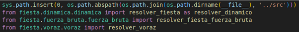
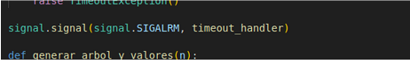
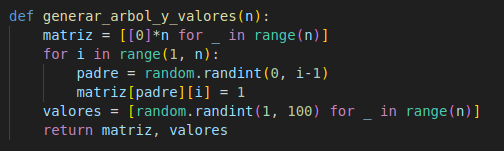
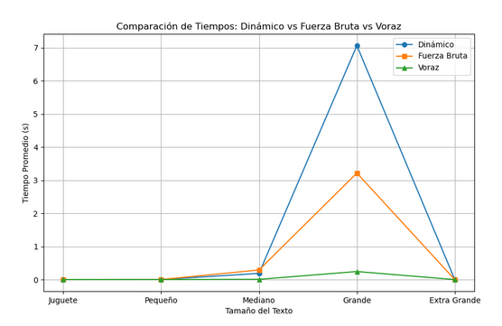

# TEST FIESTA

# Análisis Comparativo de Algoritmos para el Problema de la Fiesta

## Propósito del Código
Comparar el rendimiento de tres enfoques algorítmicos para resolver el problema de selección de invitados óptima (Problema de la Fiesta):

1. **Programación Dinámica** 
2. **Fuerza Bruta** 
3. **Algoritmo Voraz** 

### Importación de modulos

Se utilizan librerías como matplotlib (para graficar), csv (para guardar resultados) y signal (para manejar tiempos límite en fuerza bruta).

### Importación de funciones desde otros módulos del proyecto

### Control de limite de tiempo

Se define un manejador de excepción para interrumpir la fuerza bruta si excede 2 segundos:

### Generacion de entrada

Se construye un árbol de n nodos aleatoriamente, junto con valores de diversión:

### Ejecución

1. **Se prueban cuatro tamaños de árboles: 10, 100, 1000, 10000 nodos.**
2. **Para cada tamaño, se ejecutan 5 pruebas por estrategia.**
3. **Se calcula el tiempo promedio para cada algoritmo.**
4. **Los resultados se guardan en un archivo .csv.**

### Visualización

1. **Se crea un gráfico de barras para comparar visualmente los tiempos.**
2. **Se guarda en un archivo .png.**

## Grafica

