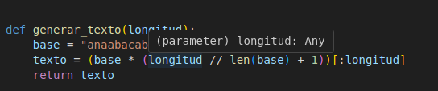
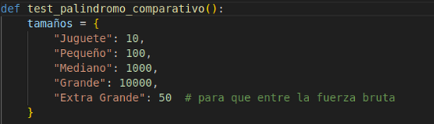
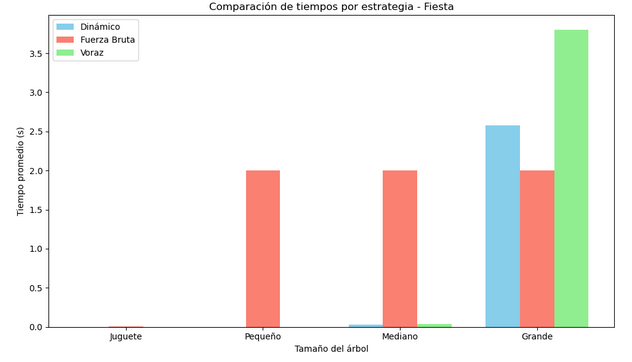

# Test palindromo
Propósito del Código
Comparar el rendimiento de tres enfoques algorítmicos para resolver el problema de selección de invitados óptima (Problema de la palindromo):

Programación Dinámica
Fuerza Bruta
Algoritmo Voraz

Importacion de modulos y funciones
 Se importan funciones desde los archivos de implementación de los algoritmos para palíndromos ubicados en src/.

 ### Generación del texto

 Se genera un texto artificial con una secuencia repetitiva para asegurar que existan palíndromos:

 ### Ejecución de pruebas comparativas

 Se prueban cinco tamaños de texto: "Juguete", "Pequeño", "Mediano", "Grande" y "Extra Grande" (este último con longitud reducida para que la fuerza bruta no tarde mucho).

 Para cada tamaño, se realizan 5 repeticiones, midiendo el tiempo de ejecución de cada algoritmo:

 ### Los resultados se imprimen por consola y se almacenan en una lista para análisis posterior.

 Se guardan en un archivo .csv llamado por ejemplo resultados_comparativo_palindromo_2025-05-08_14-25-00.csv.

 ### Visualización gráfica

 Se grafican los tiempos promedio por tamaño y algoritmo usando matplotlib.

 El gráfico se guarda como imagen .png.

Grafica
